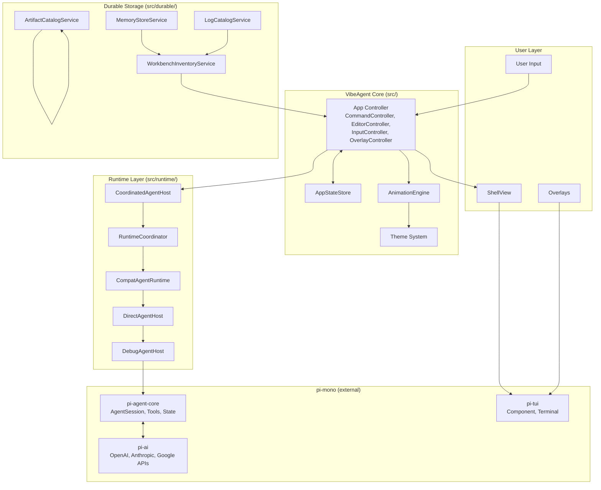
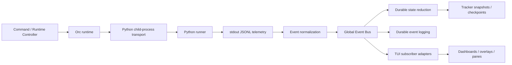
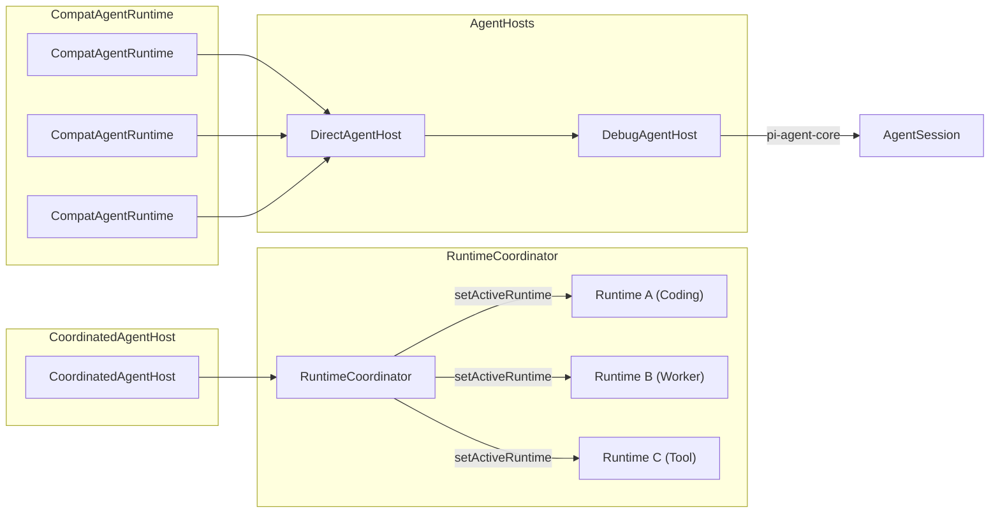
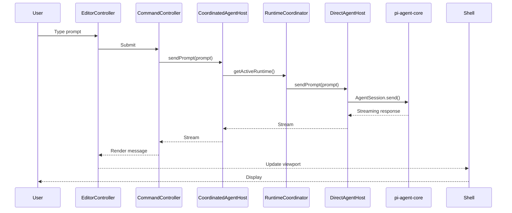
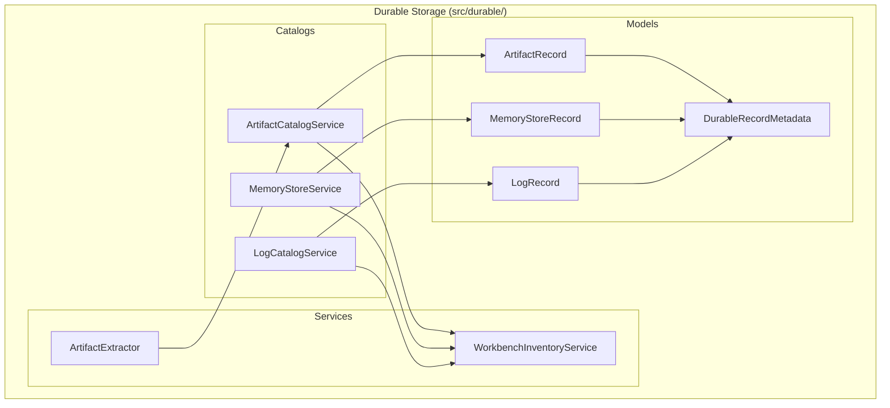
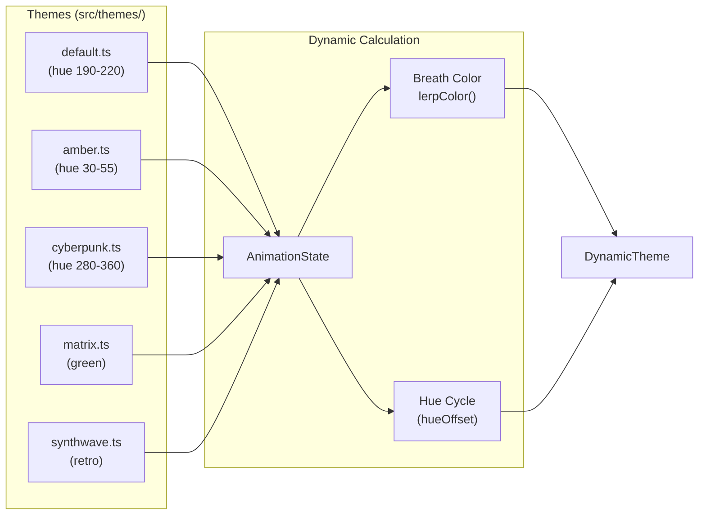

# Agent Notes: You must ALWAYS update the README.md [changelog] area with whatever changes you make to this repo

---

# Vibe Agent

> A professional terminal-based AI coding agent with a unified TUI (Terminal User Interface) experience.

Vibe Agent is built on the [pi-mono framework](https://github.com/badlogic/pi-mono/) and extends it with a comprehensive terminal-based interface using the TUI shell from `@mariozechner/pi-tui`. While pi-mono provides the core agent runtime and LLM integration, VibeAgent adds multi-runtime coordination, durable storage catalogs, a rich animation system, and an extensible overlay UI.

## Table of Contents

- [Overview](#overview)
- [Quick Start](#quick-start)
- [Architecture](#architecture)
  - [System Overview](#system-overview)
  - [pi-mono Extensions](#pi-mono-extensions)
  - [Runtime Coordinator System](#runtime-coordinator-system)
  - [Data Flow Pipeline](#data-flow-pipeline)
  - [Durable Storage Layer](#durable-storage-layer)
  - [UI Architecture](#ui-architecture)
- [User Interface](#user-interface)
  - [Shell Layout](#shell-layout)
  - [Overlay System](#overlay-system)
  - [Theme System](#theme-system)
  - [Animation System](#animation-system)
- [Commands & Shortcuts](#commands--shortcuts)
- [Configuration](#configuration)
- [Related Documentation](#related-documentation)
- [Changelog](#changelog)

---

## Overview

Vibe Agent is a terminal-based AI coding assistant that provides full feature parity with web-based coding agents while maintaining the efficiency and speed of a terminal interface.

### Key Concepts

- **Runtime Coordinator**: VibeAgent extends pi-mono's single-agent model to support multiple concurrent runtimes (coding, worker, tool), managed by a `RuntimeCoordinator`.
- **Durable Storage**: Beyond pi-mono's session storage, VibeAgent introduces catalog services for artifacts, memory stores, and logs that persist across sessions.
- **Shell UI**: A complete terminal UI with chrome (header/footer), content area, and modal overlays.
- **Animation Engine**: A global animation system driving visual effects like breathing borders, crawling separators, and glitch effects.
- **Theme System**: Dynamic themes with breath color interpolation and hue cycling.

### Built on pi-mono

VibeAgent depends on three pi-mono packages:

| Package | Purpose |
|---------|---------|
| `@mariozechner/pi-agent-core` | Core agent runtime with tool calling and state management |
| `@mariozechner/pi-ai` | Unified multi-provider LLM API (OpenAI, Anthropic, Google) |
| `@mariozechner/pi-tui` | Terminal UI library with differential rendering and components |

---

## Quick Start

### Prerequisites

- Node.js 20.6+
- Terminal with Unicode and 256-color support

### Installation

```bash
git clone https://github.com/your-repo/vibe-agent.git
cd vibe-agent
npm install
npm run build
```

### Running

```bash
# Start with default settings
npm start

# Development mode with hot reload
npm run dev

# Debug mode
npm run dev:debug
```

### First Run Setup

On first launch, the application shows a welcome screen for provider selection:

1. Select your preferred OAuth provider (Google Antigravity, OpenAI Codex, or others)
2. Complete the OAuth flow
3. Start chatting with the agent

### API Key Setup

Instead of OAuth, use API keys directly:

```bash
export ANTHROPIC_API_KEY=sk-ant-...
export OPENAI_API_KEY=sk-...
export GOOGLE_API_KEY=...
```

---

## Architecture

### System Overview



### Phase 2 orchestration architecture

Phase 2 turns Orc from a planning scaffold into a supervised execution plane. The implementation now has a stable summon path: TypeScript launches a Python runner, Python emits strict JSONL telemetry, TypeScript normalizes those envelopes into the Global Event Bus (GEB), reducers persist durable control-plane state, and TUI subscriber adapters translate the shared stream into operator-facing dashboard and overlay updates.



#### Python runner

- The stable entry point is `python3 -m src.orchestration.python.orc_runner` from the repository root.
- The TypeScript transport writes one JSON launch envelope to stdin containing thread identity, project/workspace roots, merged security policy, phase intent, and resume/checkpoint context.
- The runner reserves stdout for machine-readable JSONL only. Human-readable diagnostics and import/setup failures stay on stderr so the transport can distinguish telemetry from troubleshooting detail.
- The current bootstrap path is intentionally standard-library friendly so engineers can validate the summon contract before LangGraph and DeepAgents callback wiring is extended further.

#### JSONL transport

- `src/orchestration/orc-python-transport.ts` owns child-process spawn, stdout assembly, stderr isolation, lifecycle supervision, and coarse cancel/shutdown semantics.
- Telemetry is newline-delimited JSON so chunked stdout can be reassembled incrementally without coupling UI code to stream internals.
- Malformed lines, partial trailing data, idle stalls, and startup failures are converted into canonical warning/fault events instead of crashing the control plane.
- The transport exposes health snapshots to the runtime while hiding raw child-process handles from downstream consumers.

#### Event normalization

- Raw Python envelopes are translated into canonical Orc events with stable `who / what / how / when` semantics plus raw payload passthrough fields for forensic use.
- Normalization classifies lifecycle, graph, worker, tool, user-facing, security, warning, and fault activity into one reducer-friendly vocabulary.
- This layer deliberately separates upstream implementation noise from downstream operator language so dashboards and logs can remain stable even if LangGraph or worker callback details evolve.

#### Global Event Bus

- The asynchronous GEB is the only supported fan-out path for orchestration telemetry.
- It preserves per-run ordering, supports multiple subscribers, and applies queue/backpressure safeguards so noisy worker bursts do not directly destabilize the TUI.
- Reducers, event-log persistence, tracker snapshots, and future recovery tooling all consume the same canonical stream rather than building side-channel integrations.

#### Durable event logging

- Every normalized event can also be persisted under `~/Vibe_Agent/logs/orchestration/event-log/threads/<thread>/runs/<run>/` as append-only JSONL segments with a per-run manifest.
- Durable event logs are intentionally independent from UI rendering so replay, postmortem analysis, and Phase 3 recovery can reason about the exact published stream.
- Persistence is best-effort and non-fatal: logging failures should be visible to engineers, but they should not terminate a live operator session on their own.

#### TUI subscriber pattern

- TUI components should not subscribe to the Python transport or parser directly.
- `src/orchestration/orc-tui-subscriber.ts` is the adapter boundary that consumes GEB events, batches burst traffic, and produces dashboard, subagent, transport-health, and event-log-tail slices.
- This subscriber boundary keeps overlay lifecycle, focus/retention rules, and wording conventions stable while allowing runtime internals to evolve independently.
- Outside engineers adding panes or overlays should extend the subscriber-owned slices first, then wire the view layer to those slices rather than adding new transport listeners.

#### What is durable vs transient

| Layer | Durable | Intended consumer |
|---|---|---|
| Event log segments + manifest | Yes | Replay, forensics, future recovery tooling |
| Reduced control-plane state / tracker snapshots | Yes | Resume, operator handoff, dashboards |
| Debug artifact mirrors | Yes, opt-in | Outside engineers diagnosing transport/parser issues |
| TUI subscriber slices | No | Live dashboards, overlays, panes |
| Raw transport buffers/process handles | No | Runtime internals only |

#### Phase 2 operational boundaries

- Phase 2 supports supervised launch/resume, event normalization, durable logging, operator summaries, and fault classification.
- Phase 2 does **not** yet provide replay-aware in-flight worker resurrection; that remains Phase 3 durability work.
- Security/approval telemetry is normalized into the same event stream, but fully live upstream interception still depends on follow-on wiring where worker/tool execution emits those canonical events.

### pi-mono Extensions

VibeAgent extends pi-mono in four key ways:

#### FORKED - Major Custom Implementations

| Component | File | Description |
|-----------|------|-------------|
| `RuntimeCoordinator` | [`src/runtime/runtime-coordinator.ts`](src/runtime/runtime-coordinator.ts) | Multi-runtime management system allowing concurrent coding, worker, and tool runtimes |
| `DirectAgentHost` | [`src/direct-agent-host.ts`](src/direct-agent-host.ts) | Custom agent host with command discovery, model cycling, and scoped model support |
| `AgentHost` interface | [`src/agent-host.ts`](src/agent-host.ts) | Extended state properties (sessionName, autoCompactionEnabled, pendingMessageCount) |
| Durable Storage | [`src/durable/`](src/durable/) | Entire durable storage catalog system (artifacts, memory, logs) |
| `VibeAgentApp` | [`src/app.ts`](src/app.ts) | Main application orchestrating all components |

#### WRAPPED - Decorator Pattern

| Component | File | Description |
|-----------|------|-------------|
| `CoordinatedAgentHost` | [`src/runtime/coordinated-agent-host.ts`](src/runtime/coordinated-agent-host.ts) | Delegates all `AgentHost` operations to the active runtime in the coordinator |
| `DebugAgentHost` | [`src/debug-agent-host.ts`](src/debug-agent-host.ts) | Timing and logging decorator wrapping any `AgentHost` |

#### SHIMMED - Interface Adapters

| Component | File | Description |
|-----------|------|-------------|
| `CompatAgentRuntime` | [`src/runtime/compat-agent-runtime.ts`](src/runtime/compat-agent-runtime.ts) | Adapts any `AgentHost` to `AgentRuntime` by adding the `descriptor` property |
| `AgentHost` types | [`src/agent-host.ts`](src/agent-host.ts) | Local interface shim extending pi-mono's `AgentHost` with VibeAgent-specific state |

#### BRIDGED - External Dependencies

| Component | File | Description |
|-----------|------|-------------|
| pi-mono packages | [`package.json`](package.json) | Imports `@mariozechner/pi-agent-core`, `@mariozechner/pi-ai`, `@mariozechner/pi-tui` as external dependencies |
| `local-coding-agent` | [`src/local-coding-agent.ts`](src/local-coding-agent.ts) | Bridges pi-agent-core exports for local use |

---

### Runtime Coordinator System



The `RuntimeCoordinator` ([`src/runtime/runtime-coordinator.ts`](src/runtime/runtime-coordinator.ts)) manages multiple `AgentRuntime` instances:

- **start()**: Initializes all runtimes (not just the active one)
- **stop()**: Shuts down all runtimes in reverse order
- **setActiveRuntime(id)**: Switches the active runtime for user interactions
- **getActiveRuntime()**: Returns the currently active runtime

Each runtime is wrapped in a `CompatAgentRuntime` ([`src/runtime/compat-agent-runtime.ts`](src/runtime/compat-agent-runtime.ts)) which adds a `RuntimeDescriptor` with:

- `id`: Unique identifier
- `kind`: "coding" | "worker" | "tool"
- `displayName`: Human-readable name
- `capabilities`: Array of capability strings
- `primary`: Boolean indicating primary runtime

---

### Data Flow Pipeline



**Pipeline Stages:**

1. **Input** ([`src/editor-controller.ts`](src/editor-controller.ts)): User types in the terminal editor, handles keybindings, history, and file references (`@` mention)
2. **Command Routing** ([`src/command-controller.ts`](src/command-controller.ts)): Slash commands (`/new`, `/resume`, `/model`) are intercepted and processed
3. **Runtime Delegation**: `CoordinatedAgentHost` delegates to `RuntimeCoordinator.getActiveRuntime()`
4. **Agent Execution** ([`src/direct-agent-host.ts`](src/direct-agent-host.ts)): `DirectAgentHost` wraps pi-mono's `AgentSession` and adds command discovery
5. **Message Sync** ([`src/app/app-message-sync-service.ts`](src/app/app-message-sync-service.ts)): Syncs messages between host and shell view
6. **Rendering** ([`src/message-renderer.ts`](src/message-renderer.ts)): Transforms `AgentMessage[]` to TUI components
7. **State Update** ([`src/app-state-store.ts`](src/app-state-store.ts)): Central reactive state triggers UI refreshes

---

### Durable Storage Layer



The durable storage layer ([`src/durable/`](src/durable/)) now anchors Vibe-owned long-lived state under `~/Vibe_Agent` while keeping inherited pi-mono auth/session files in `~/.pi/agent` until an explicit migration is shipped. This makes the storage split reversible and easy to audit.


| Service | File | Description |
|---------|------|-------------|
| `ArtifactCatalogService` | [`src/durable/artifacts/artifact-catalog-service.ts`](src/durable/artifacts/artifact-catalog-service.ts) | Tracks files created/modified by the agent |
| `ArtifactExtractor` | [`src/durable/artifacts/artifact-extractor.ts`](src/durable/artifacts/artifact-extractor.ts) | Parses `AgentMessage[]` to extract artifact records |
| `MemoryStoreService` | [`src/durable/memory/memory-store-service.ts`](src/durable/memory/memory-store-service.ts) | Tracks memory store manifests |
| `LogCatalogService` | [`src/durable/logs/log-catalog-service.ts`](src/durable/logs/log-catalog-service.ts) | Manages log records |
| `WorkbenchInventoryService` | [`src/durable/workbench-inventory-service.ts`](src/durable/workbench-inventory-service.ts) | Unified facade over all catalogs |

All durable records share common metadata defined in [`src/durable/record-metadata.ts`](src/durable/record-metadata.ts):

```typescript
interface DurableRecordMetadata {
    id: string;
    kind: string;
    ownerRuntimeId: string;
    sessionId?: string;
    sourcePath?: string;
    createdAt: string;
    updatedAt: string;
    status: DurableRecordStatus;
    tags: string[];
}
```

---

### UI Architecture

#### Shell Layout

```mermaid
graph TB
    subgraph "ShellView (src/shell-view.ts)"
        subgraph "Chrome"
            Header["Header<br/>(session, git branch)"]
            MenuBar["MenuBar<br/>(F1, F2 hints)"]
            SepTop["Separator (animated)"]
        end

        subgraph "Content"
            SBC["SideBySideContainer"]
            SBC --> Transcript["TranscriptViewport"]
            SBC --> Sessions["SessionsPanel (toggleable)"]
        end

        subgraph "Widgets"
            WidgetsAbove["Widget Container (above editor)"]
            Editor["Editor (CustomEditor)"]
            WidgetsBelow["Widget Container (below editor)"]
        end

        subgraph "Footer"
            Footer["Footer (status, providers, model)"]
            Thinking["ThinkingTray"]
        end
    end

    Header --> SepTop
    SepTop --> SBC
    SBC --> WidgetsAbove
    WidgetsAbove --> Editor
    Editor --> WidgetsBelow
    WidgetsBelow --> Footer
    Footer --> Thinking
```

The shell view ([`src/shell-view.ts`](src/shell-view.ts)) manages the complete TUI layout:

- **Chrome**: Box-rendered borders with session info, animated separators, menu hints
- **Content Area**: `SideBySideContainer` with transcript and optional sessions panel
- **Editor**: Multi-line `CustomEditor` from pi-tui with border color indicating thinking level
- **Footer**: Status line, provider/model info, thinking level, session badge
- **Thinking Tray**: Expandable panel showing AI thinking with markdown rendering

#### Overlay System

Overlays ([`src/overlay-controller.ts`](src/overlay-controller.ts)) are modal components that stack on top of the shell:

| Overlay | File | Purpose |
|---------|------|---------|
| `FilterSelectOverlay` | [`src/components/filter-select-overlay.ts`](src/components/filter-select-overlay.ts) | Searchable list with keyboard/mouse selection |
| `TextPromptOverlay` | [`src/components/text-prompt-overlay.ts`](src/components/text-prompt-overlay.ts) | Simple text input |
| `EditorOverlay` | [`src/components/editor-overlay.ts`](src/components/editor-overlay.ts) | Full editor in modal |
| `ShellMenuOverlay` | [`src/components/shell-menu-overlay.ts`](src/components/shell-menu-overlay.ts) | Nested shell-style menu |
| `HelpOverlay` | [`src/components/help-overlay.ts`](src/components/help-overlay.ts) | Keybinding reference |
| `SessionStatsOverlay` | [`src/components/session-stats-overlay.ts`](src/components/session-stats-overlay.ts) | Token and session statistics |
| `ArtifactViewer` | [`src/components/artifact-viewer.ts`](src/components/artifact-viewer.ts) | File browser for artifacts |

**Overlay Stack Management:**

[`src/overlay-controller.ts`](src/overlay-controller.ts:40-50):
```typescript
interface OverlayRecord {
    id: string;
    component: Component;
    options: OverlayOptions;
    hide: () => void;
}
```

Layout resolution ([`src/overlay-layout.ts`](src/overlay-layout.ts)) calculates position based on:
- `anchor`: "center", "top-left", "bottom-right", etc.
- `margin`: Can be number or `{top, bottom, left, right}`
- `width`/`maxHeight`: Absolute or percentage strings

#### Theme System



Themes ([`src/themes/`](src/themes/)) define visual aesthetics with breath color interpolation:

```typescript
interface ThemeConfig {
    breathBaseColor: string;   // "#254560" (dark)
    breathPeakColor: string;    // "#60d2ff" (bright)
    hueRange: [number, number];
    hueSaturation: number;
    hueLightness: number;
}
```

Dynamic colors are computed from `AnimationState` ([`src/animation-engine.ts`](src/animation-engine.ts)):

- `breathPhase`: Sine wave (0→1→0) interpolating between base and peak colors
- `hueOffset`: Slowly cycles 0-359 for animated border colors

#### Animation System

The animation engine ([`src/animation-engine.ts`](src/animation-engine.ts)) runs at 80ms tick intervals, updating:

| Property | Update | Purpose |
|----------|--------|---------|
| `tickCount` | Every tick | Global counter |
| `hueOffset` | +2 (streaming) / +0.8 | Cycles through hues |
| `spinnerFrame` | +1 mod 8 | Braille spinner animation |
| `breathPhase` | `sin(tickCount/50 * 2π)` | Breathing effect |
| `glitchActive` | Every 75 ticks | Brief glitch effect |
| `separatorOffset` | +1 every 8 ticks | Crawling separator |
| `wipeTransition` | 0→3→0 | Session switch animation |
| `focusFlashTicks` | Decrement | Focus change flash |

**Animation Presets (20 effects):**

Located in [`src/components/anim_*.ts`](src/components/):

| Animation | File | Visual |
|-----------|------|--------|
| Boids | [`anim_boids.ts`](src/components/anim_boids.ts) | Flocking simulation |
| Data Rain | [`anim_datarain.ts`](src/components/anim_datarain.ts) | Matrix-style glyph rain |
| Doom Fire | [`anim_doomfire.ts`](src/components/anim_doomfire.ts) | Classic Doom fire |
| Flow Field | [`anim_flowfield.ts`](src/components/anim_flowfield.ts) | Noise-driven particles |
| Game of Life | [`anim_gameoflife.ts`](src/components/anim_gameoflife.ts) | Cellular automaton |
| Glyph Cascade | [`anim_glyphcascade.ts`](src/components/anim_glyphcascade.ts) | Oscillating glyph rows |
| Laser Scan | [`anim_laserscan.ts`](src/components/anim_laserscan.ts) | Scanning beam |
| Lissajous | [`anim_lissajous.ts`](src/components/anim_lissajous.ts) | Parametric curves |
| Matrix Rain | [`anim_matrixrain.ts`](src/components/anim_matrixrain.ts) | Katakana column rain |
| Noise Field | [`anim_noisefield.ts`](src/components/anim_noisefield.ts) | FBM noise pattern |
| Orbit Arc | [`anim_orbitarc.ts`](src/components/anim_orbitarc.ts) | Spinner with trails |
| Plasma | [`anim_plasma.ts`](src/components/anim_plasma.ts) | Wave interference |
| Pulse Meter | [`anim_pulsemeter.ts`](src/components/anim_pulsemeter.ts) | Progress bars |
| Spectrum Bars | [`anim_spectrumbars.ts`](src/components/anim_spectrumbars.ts) | Audio visualization |
| Starfield | [`anim_starfield.ts`](src/components/anim_starfield.ts) | 3D star field |
| Synthgrid | [`anim_synthgrid.ts`](src/components/anim_synthgrid.ts) | Perspective grid |
| Vortex | [`anim_vortex.ts`](src/components/anim_vortex.ts) | Spiral particles |
| Water Ripple | [`anim_waterripple.ts`](src/components/anim_waterripple.ts) | 2D wave propagation |
| Wave Sweep | [`anim_wavesweep.ts`](src/components/anim_wavesweep.ts) | Gaussian wave pulse |

For detailed animation documentation, see [styleguide.md](styleguide.md).

---

## User Interface

### Shell Layout

From top to bottom:

```
┌─ chromeHeader ──────────────────────────────────────────────────────────┐
│  Vibe Agent  │  session:name  │  main*  │  ● connected  │  F1 │ F2   │
├─ chromeSeparatorTop (animated crawling line) ───────────────────────────┤
│                                                                       │
│  ┌─ transcriptViewport ────────────────────────────────────────────┐  │
│  │  User message                                                      │  │
│  │  Assistant response                                                │  │
│  │    Thinking (collapsible)                                         │  │
│  │    Tool execution                                                  │  │
│  └───────────────────────────────────────────────────────────────────┘  │
│                                                                       │
│  ┌─ sessionsPanel (toggleable) ───────────────────────────────────┐  │
│  │  Session list                                                      │  │
│  └───────────────────────────────────────────────────────────────────┘  │
│                                                                       │
├─ widgetContainerAbove ────────────────────────────────────────────────┤
│  ┌─ editorContainer ───────────────────────────────────────────────┐  │
│  │  Multi-line editor with thinking-level border color             │  │
│  └───────────────────────────────────────────────────────────────────┘  │
├─ widgetContainerBelow ─────────────────────────────────────────────────┤
├─ footerContentContainer ───────────────────────────────────────────────┤
│  Status: Ready  │  anthropic │ sonnet-4  │  thinking:high  │  session  │
├─ chromeStatus ─────────────────────────────────────────────────────────┤
│  Working message / typewriter status                                   │
├─ chromeSummary ────────────────────────────────────────────────────────┤
│  Providers  │  Model  │  Thinking Level  │  Message Count           │
└─ thinkingTray (expandable) ────────────────────────────────────────────┘
```

### Overlay System

Overlays appear centered on screen with a dark backdrop:

- **Command Palette** (`F1`): Filterable command list
- **Model Selector** (`Ctrl+L`): Switch between models
- **Thinking Level** (`Shift+Tab`): Adjust reasoning budget
- **Session Browser** (`/resume`): Resume previous sessions
- **Help** (`/help`): Keybinding reference
- **Stats** (`/stats`): Token usage and statistics
- **Artifacts** (`/artifacts`): Browse created files

### Mouse Handling

Mouse support is enabled via XTerm SGR protocol ([`src/mouse-enabled-terminal.ts`](src/mouse-enabled-terminal.ts)):

- **Click**: Select items, activate buttons
- **Scroll**: Navigate transcript, overlays
- **Drag**: Select text in editor

Mouse events are dispatched through [`src/input-controller.ts`](src/input-controller.ts) to either the transcript viewport or the overlay stack.

---

## Commands & Shortcuts

### Slash Commands

Type `/` in the editor to trigger commands.

| Command | Description |
|---------|-------------|
| `/new` | Start new session |
| `/resume` | Browse and resume previous sessions |
| `/fork` | Create new session from current branch |
| `/tree` | Navigate session tree |
| `/name <name>` | Set session display name |
| `/compact [prompt]` | Compact context |
| `/export [path]` | Export to HTML |
| `/stats` | Show statistics |
| `/artifacts` | View artifacts |
| `/model` | Open model selector |
| `/thinking` | Open thinking level selector |
| `/settings` | Open settings |
| `/help` | Show help |
| `/clear` | Clear display |
| `/debug-dump` | Write debug snapshot |

### Keyboard Shortcuts

#### Global

| Key | Action |
|-----|--------|
| `F1` | Open command palette |
| `Ctrl+Q` | Quit |
| `Esc` | Close overlay / abort streaming |
| `Shift+Ctrl+D` | Write debug snapshot |

#### Editor

| Key | Action |
|-----|--------|
| `Enter` | Submit prompt |
| `Shift+Enter` | New line |
| `Ctrl+C` | Abort streaming / clear editor |
| `Ctrl+D` | Quit (when empty) |
| `Ctrl+L` | Open model selector |
| `Shift+Tab` | Cycle thinking level |
| `Ctrl+Shift+Up/Down` | Cycle models |
| `Ctrl+E` | Toggle tool output |
| `Ctrl+T` | Toggle thinking |
| `Up/Down` | Navigate history |
| `@` | Fuzzy file search |
| `Tab` | Path completion |
| `!command` | Run and send output |
| `!!command` | Run without sending |

---

## Configuration

### App Config File

Vibe-owned defaults now live at `~/Vibe_Agent/config/vibe-agent-config.json`. Startup also bootstraps the following private directories when possible: `artifacts/`, `logs/`, `memory/`, `auth/`, `config/`, `checkpoints/`, `tracker/`, `plans/`, and `sessions/`.

```text
~/Vibe_Agent/
├── artifacts/
├── auth/
├── checkpoints/
├── config/
│   └── vibe-agent-config.json
├── logs/
├── memory/
├── plans/
├── sessions/
└── tracker/
```

Data that remains in pi-mono storage for now:

- `~/.pi/agent/auth.json` managed by pi-mono `AuthStorage`
- coding-runtime session files that still rely on pi-mono session management

Example config:

```json
{
    "setupComplete": true,
    "selectedProvider": "google-antigravity",
    "selectedTheme": "default",
    "showThinking": true
}
```

### Environment Variables

| Variable | Description |
|----------|-------------|
| `ANTHROPIC_API_KEY` | Anthropic API key |
| `OPENAI_API_KEY` | OpenAI API key |
| `GOOGLE_API_KEY` | Google AI API key |
| `PI_MONO_APP_DEBUG_BUNDLE` | Debug bundle output directory |

### Theme Selection

Themes are configured via `selectedTheme` in the config file or the `/settings` command:

| Theme | Hue Range | Aesthetic |
|-------|-----------|-----------|
| `default` | 190-220 (blue) | Clean, professional |
| `amber` | 30-55 (amber) | Retro terminal |
| `cyberpunk` | 280-360 (magenta) | Neon glow |
| `matrix` | Green palette | Classic matrix |
| `synthwave` | Retro colors | 80s aesthetic |

---

## Related Documentation

### [docs/orchestration/phase-1-scaffold.md](docs/orchestration/phase-1-scaffold.md)

Use [docs/orchestration/phase-1-scaffold.md](docs/orchestration/phase-1-scaffold.md) as the stable orientation guide for the Orc Phase 1 scaffold, including the F3 launch path, `src/orchestration/` module layout, durable storage tree under `~/Vibe_Agent`, and the current placeholder boundaries for checkpoints, tracker state, subagents, and LangGraph execution.

### [docs/orchestration/phase-2-execution-plan.md](docs/orchestration/phase-2-execution-plan.md)

Use [docs/orchestration/phase-2-execution-plan.md](docs/orchestration/phase-2-execution-plan.md) as the planning guide for the next Orc implementation wave. It enumerates the Phase 2 backlog for the Python LangGraph runner, JSONL stdout transport, async Global Event Bus, TUI telemetry subscribers, durable event logging, and the error-handling/debug work needed before live worker execution can be considered robust.

### [styleguide.md](styleguide.md) — LIVING DOCUMENT

The [styleguide.md](styleguide.md) is a **LIVING DOCUMENT** covering UI and animation implementation details:

- **Animation System**: AnimationEngine tick behavior, AnimationState properties
- **Animation Presets**: All 20 animation effects with options and use cases
- **Styling Conventions**: Box drawing, separators, color interpolation
- **Component Patterns**: Component interface, viewport pattern, overlay pattern
- **Creating New Animations**: Templates and guidelines

Refer to styleguide.md for detailed animation development documentation.


## Orc debugging and diagnostics

The new Orc debug mode is **opt-in**. It is intended for outside engineers diagnosing transport, parser, Python-runner, reducer, or event-bus problems and is intentionally kept out of the default operator-friendly dashboard surfaces.

### Outside engineer troubleshooting and diagnostics

Use this escalation order when Orc behavior is unclear:

1. **Start with the tracker snapshot** to confirm the reduced run state, terminal summary, blockers, and last known checkpoint-worthy boundary.
2. **Open the durable event log** to see the canonical event sequence exactly as reducers and subscribers consumed it.
3. **Enable debug mode only if needed** to inspect stderr, raw event mirrors, parser warnings, and transport diagnostics for low-level stream problems.
4. **Compare tracker vs event log vs debug artifacts** before changing code; disagreements usually indicate normalization, transport, or recovery-boundary issues.

| Diagnostic goal | Primary artifact | Why it matters |
|---|---|---|
| Confirm whether the run really launched | `runtime-metadata.json` + `transport-diagnostics.jsonl` | Shows the spawn command, cwd, run/thread ids, and startup lifecycle edges. |
| Confirm what the control plane believed | Tracker snapshot JSON / `LANGEXTtracker.md` | Captures the reduced, handoff-safe summary used by operators and future resume logic. |
| Confirm exact published telemetry | Durable event-log segment JSONL + `manifest.json` | Represents the normalized bus stream independent from UI wording. |
| Confirm parser or stream corruption | `parser-warnings.jsonl` + `raw-event-mirror.jsonl` | Distinguishes malformed stdout from downstream reducer or subscriber bugs. |
| Confirm Python-side failure details | `python-stderr.jsonl` | Keeps stderr out of the JSONL telemetry path while preserving root-cause text. |

### Fast triage matrix

| Symptom | Likely layer | First check | Follow-up |
|---|---|---|---|
| No run appears in Orc UI | Runtime / spawn | `runtime-metadata.json`, `transport-diagnostics.jsonl` | Confirm the Python module path and working directory. |
| Run starts but never becomes readable | Transport readiness | `transport_ready_timeout` / `transport_idle_timeout` records | Compare against stderr and event-log gaps. |
| UI wording looks wrong but event order is correct | Presentation / subscriber | Durable event log vs tracker snapshot | Inspect normalization/presentation helpers before touching transport code. |
| Tracker says failed but logs look mixed | Terminal-state reduction | Tracker snapshot, final event-log segment | Check for ambiguous terminal events or duplicate terminal publication guards. |
| Resume restores metadata but not live work | Expected Phase 2 limitation | Tracker snapshot + checkpoint metadata | Treat as deferred Phase 3 replay/recovery work, not a Phase 2 transport bug. |

### Debug toggle

- Config shape: `orchestration.debug.enabled` in `~/Vibe_Agent/config/vibe-agent-config.json`.
- Runtime hook: pass `debugMode: { enabled: true }` into `OrcRuntimeSkeleton` adapters when embedding the runtime directly.
- Current caveat: the config schema is normalized and documented now, but the main app still needs follow-on wiring to automatically thread that toggle into the live Orc runtime constructor.

Example config snippet:

```json
{
  "orchestration": {
    "debug": {
      "enabled": true
    }
  }
}
```

### Where debug artifacts live

All Orc durable data still roots at `~/Vibe_Agent/`. When debug mode is enabled for a run, engineers should expect these locations:

| Artifact | Location | Notes |
|---|---|---|
| Python stderr | `~/Vibe_Agent/logs/orchestration/debug/threads/<thread>/runs/<run>/python-stderr.jsonl` | Raw stderr lines plus truncation metadata. |
| Raw event mirror | `~/Vibe_Agent/logs/orchestration/debug/threads/<thread>/runs/<run>/raw-event-mirror.jsonl` | Canonical stdout envelopes mirrored before reducer/UI summarization. |
| Parser warnings | `~/Vibe_Agent/logs/orchestration/debug/threads/<thread>/runs/<run>/parser-warnings.jsonl` | Recoverable parse noise plus fatal corruption threshold context. |
| Transport diagnostics | `~/Vibe_Agent/logs/orchestration/debug/threads/<thread>/runs/<run>/transport-diagnostics.jsonl` | Lifecycle snapshots, warnings, faults, and health metadata. |
| Runtime metadata | `~/Vibe_Agent/logs/orchestration/debug/threads/<thread>/runs/<run>/runtime-metadata.json` | Run/thread ids, transport command info, artifact paths, and safety caveats. |
| Durable event log | `~/Vibe_Agent/logs/orchestration/event-log/threads/<thread>/runs/<run>/` | Normalized bus events for replay/postmortem analysis. |
| Tracker snapshots | `~/Vibe_Agent/tracker/<thread>--<checkpoint>.json` | Reduced durable state for resume/handoff, not raw debug detail. |
| Tracker export snapshot | `~/Vibe_Agent/tracker/LANGEXTtracker.md` | Reserved markdown export location for tracker snapshots and handoffs. |

### Practical troubleshooting workflow

1. **Runner will not start**: inspect `runtime-metadata.json` and `transport-diagnostics.jsonl` first to confirm the spawn command/cwd and whether startup failed before the ready envelope.
2. **Malformed JSONL**: inspect `parser-warnings.jsonl` for `transport_parse_noise` or `transport_corrupt_stream`, then compare the same run in `raw-event-mirror.jsonl` and `python-stderr.jsonl`.
3. **Missing Python runner entry point**: confirm the runtime is still launching `python3 -m src.orchestration.python.orc_runner` from the repository root and that stderr captured the import/module failure.
4. **Stalled stream**: check `transport-diagnostics.jsonl` for `transport_idle_timeout`, `transport_stall_timeout`, or `transport_ready_timeout`; correlate timestamps with event-log gaps.
5. **Transport startup failure**: inspect `transport-diagnostics.jsonl` + `python-stderr.jsonl`, then compare against the latest tracker snapshot to see whether the run ever crossed into a durable checkpoint boundary.

### Safety caveats

- Leave debug mode **off by default**; it records low-level payload mirrors and transport detail that are too noisy for the default Orc UI.
- Debug files are durable and may include provider/tool payload fragments, command previews, or stderr text that should be reviewed before sharing outside the engineering team.
- Tracker snapshots stay intentionally slim even when debug mode is enabled; use debug artifacts + event logs together for forensics.

## Orc Python runner local execution assumptions

- Stable runner package location: `src/orchestration/python/orc_runner/`, invoked locally as `python3 -m src.orchestration.python.orc_runner` from the repository root.
- The TypeScript parent process must write a single JSON object to stdin containing the thread id, absolute project/workspace roots, merged security-policy snapshot, phase intent, and resume/checkpoint context.
- Stdout is reserved for newline-delimited JSON telemetry only; any human-readable diagnostics, stack traces, or import/setup failures must go to stderr.
- The bootstrap currently relies only on the Python 3 standard library so local static inspection works before LangGraph/DeepAgents dependencies are wired in. Future production packaging can layer extra dependencies onto the same module path without changing the TypeScript spawn contract.

---

## Changelog

| Date | Version | Changes |
|------|---------|---------|
| 2026-03-23 | 1.0.5 | Added opt-in Orc debug-mode documentation, durable artifact locations, and troubleshooting guidance for transport/parser failures |
| 2026-03-22 | 1.0.4 | Added the stable Orc Python runner location, local execution assumptions, and stdin/stdout/stderr contract documentation for outside engineers |
| 2026-03-22 | 1.0.2 | Added Phase 1 orchestration scaffold documentation for outside engineers and linked the README to the new Orc architecture guide |
| 2026-03-22 | 1.0.3 | Added the Phase 2 execution-plan guide and linked the README to the new Orc worker-plane/task-planning documentation |
| 2026-03-22 | 1.0.1 | Added the `~/Vibe_Agent` durable root, startup directory bootstrapping, Orc session relocation, and migration notes documenting which data still remains in pi-mono storage |
| 2026-03-21 | 1.0.0 | Initial comprehensive README rewrite with architecture diagrams, pi-mono extension documentation, runtime coordinator system, durable storage layer, and UI architecture |

---

# Agent Notes: You must ALWAYS update the README.md [changelog] area with whatever changes you make to this repo
