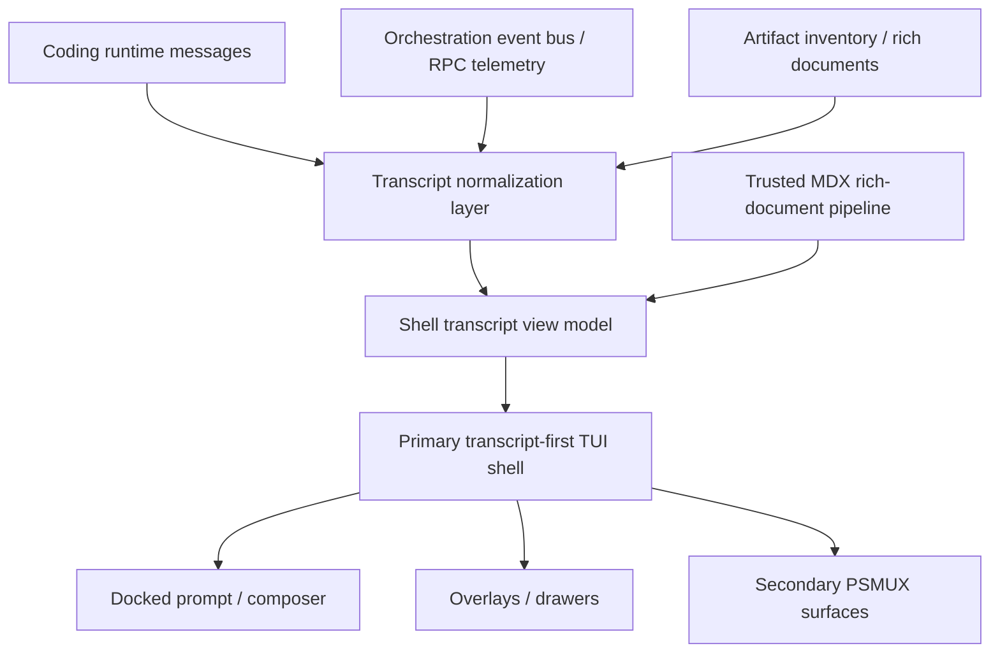

# Main Shell Redesign Plan

This document is the implementation reference for replacing the current VibeAgent main shell with a transcript-first terminal UI modeled directly on OpenCode's session shell patterns.

The redesign is a fresh main-shell implementation. It does not preserve the current cockpit layout, and it does not depend on a full backend rewrite. The runtime, orchestration, event bus, RPC bridge, durable storage, and PSMUX session model remain the backend foundation.

This plan expands the architectural baseline from `docs/shellview.md`, which documents the current `pi-tui` shell in detail. That document is the legacy-system inventory for this redesign.

## Outcome

The new main shell should behave like a session document:

- one dominant transcript surface;
- a docked prompt/composer below the transcript;
- inline thinking history, tool activity, artifacts, and orchestration events in one unified timeline;
- minimal persistent chrome;
- overlays and secondary terminals for non-core surfaces; and
- a constrained MDX-backed rich-document pipeline for artifact-class and trusted shell content.

The main terminal inside the PSMUX primary pane remains the operator's default surface. Secondary panes and future floating surfaces remain explicit first-class concepts, but they are not allowed to force the primary shell back into a fixed-row dashboard layout.

## Current State In This Repo

The current shell is built around a fixed-layout `pi-tui` surface:

- `src/shell-view.ts` assembles a cockpit made of header, menu bar, transcript area, widgets, editor, footer, status, summary, and a dedicated thinking tray.
- `src/shell/shell-layout.ts` computes the transcript viewport as the remainder after fixed-height chrome is subtracted from terminal height.
- `src/components/transcript-viewport.ts` can technically scroll a large transcript, but the overall shell experience is constrained by the surrounding layout and the detached thinking surface.
- `src/app/app-message-sync-service.ts` currently forces `hideThinking: true`.
- `src/components/thinking-tray.ts` truncates live reasoning into a small fixed tray instead of preserving it inline in transcript history.
- `src/message-renderer.ts` renders directly from `AgentMessage[]` to `pi-tui` components, which is too flat for a mixed transcript of coding, artifacts, orchestration, and subagent events.

The backend seams are already cleaner than the shell:

- `src/app/app-runtime-factory.ts` and `src/runtime/runtime-coordinator.ts` show that runtime coordination is already distinct from the shell view.
- `src/psmux-runtime-context.ts`, `src/launcher/psmux-launcher.ts`, and `src/orchestration/terminal/session_manager.ts` already establish the multi-terminal PSMUX direction.
- `src/orchestration/orc-runtime/thread-context-factory.ts` and the surrounding Orc runtime files already expose a durable event-bus architecture that can feed a richer shell.

The main problem is therefore not transcript storage. It is the shell surface model.

## Legacy Inventory And Migration Targets

`docs/shellview.md` makes the current shell responsibilities explicit. The redesign should treat each one as either:

- preserved and re-expressed in the new shell;
- moved to overlay or secondary-surface form; or
- retired entirely.

### Legacy-to-target mapping

| Current responsibility | Current owner | New owner / disposition |
| --- | --- | --- |
| Main shell contract | `src/shell-view.ts` | Replace with a transcript-first shell surface contract; keep temporary compatibility adapter only during migration |
| Fixed-row shell layout | `src/shell/shell-layout.ts` | Retire; new shell uses transcript-first layout with docked prompt and minimal top/bottom chrome |
| Transcript scroll model | `src/components/transcript-viewport.ts`, `src/shell/shell-transcript-controller.ts` | Replace with OpenTUI scrollbox/session transcript model |
| Thinking tray | `src/components/thinking-tray.ts`, `src/shell/shell-thinking-sync.ts` | Retire as a surface; thinking becomes inline transcript content |
| Sessions side panel | `src/components/sessions-panel.ts`, `src/shell/shell-sessions-controller.ts`, `src/components/side-by-side-container.ts` | Move to overlay or secondary surface; do not keep transcript split-pane in main shell |
| Header/menu/status/summary chrome | `src/shell/shell-chrome-renderer.ts` | Replace with minimal shell chrome: meta row, prompt hints, lightweight status affordances |
| Extension header/footer/widgets | `src/shell/shell-extension-chrome.ts`, `src/extension-ui-host.ts` | Preserve capability but remap to overlay, drawer, inline transcript block, or prompt-adjacent micro-surface |
| Global shell input routing | `src/input-controller.ts` | Preserve commands and scrolling behavior, but retarget to the new shell action model |
| App shell state | `src/app-state-store.ts` | Preserve shared behavioral state where still valid; remove layout-specific assumptions |
| Footer/context/git/psmux metadata | `src/footer-data-provider.ts` | Preserve and remap into shell meta row and secondary views |
| Shell animations | `src/animation-engine.ts` | Keep only useful motion for status and focus; retire wipe-based full-pane shell metaphors |

### Legacy behaviors that must remain functional

The redesign still needs to support these documented shell capabilities:

- transcript scrolling by keyboard and mouse;
- F1/F2/F3 command entry points or equivalent discoverable replacements;
- overlay-based menus and selectors;
- editor/prompt focus ownership;
- runtime/session labeling;
- artifact visibility;
- model and thinking-level controls;
- extension-provided status and custom UI entry points; and
- at least one surfaced session-management workflow.

## Target Architecture

The new shell should follow this shape:

### Shell stack

The new primary shell foundation should use:

- `@opentui/core`
- `@opentui/solid`
- `solid-js`

These are introduced specifically for the new main shell. They are not a mandate to port the rest of the application UI stack immediately.

### What is borrowed from OpenCode

The OpenCode influence is architectural, not wholesale:

- transcript-first session layout;
- one main scroll surface with sticky-bottom follow behavior;
- prompt/composer docked outside the transcript scroll region;
- part-based transcript rendering;
- inline thinking/tool rendering instead of detached fixed chrome; and
- keyboard-friendly terminal navigation.

The redesign should not import OpenCode runtime state, model/provider logic, storage layout, or business logic. Only the TUI shell patterns are candidates for direct fork/adaptation.

## Design Principles

1. The transcript is the product.
2. The prompt is docked, not embedded.
3. Thinking is history, not a tray.
4. Tools, artifacts, and orchestration events belong in one timeline.
5. Fixed row consumers must be minimized.
6. Secondary surfaces are launched intentionally, not simulated inside the primary shell.
7. Rich content must be safe by default.

## Shared Shell Model

The current direct `AgentMessage[] -> rendered components` path should be replaced with an intermediate shell model.

### New model types

Add shared shell-facing model types:

- `TranscriptItem`
- `TranscriptPart`
- `ShellSurfaceDescriptor`
- `RichDocumentSource`
- `RichDocumentRenderModel`

### Required transcript item kinds

The new transcript model must support at least:

- `user`
- `assistant-text`
- `assistant-thinking`
- `tool-call`
- `tool-result`
- `artifact`
- `runtime-status`
- `subagent-event`
- `checkpoint`
- `error`

### Normalization rules

- Coding-runtime chat messages are normalized into transcript items before rendering.
- Tool calls/results become explicit timeline entries instead of implicit side effects on assistant blocks.
- Thinking remains attached to the originating assistant turn as inline collapsible content.
- Orc event bus and RPC telemetry should map into transcript items rather than bespoke shell widgets.
- Artifact catalog updates can appear either as transcript references or shell-opened rich-document views, depending on user action.

### Required part structure

`TranscriptItem` should not be a single blob. It should support nested parts so that one timeline item can own:

- visible summary text;
- collapsible detail blocks;
- status badges;
- linked artifact references;
- shell actions such as expand, collapse, open overlay, or open surface.

That structure is required to replace:

- detached thinking state,
- expandable tool results,
- session/runtime badges now shown in summary chrome, and
- future orchestration event cards.

## New Main Shell Interface

The old shell interface is centered on `setMessages(Component[])` and row-based chrome composition. The new shell interface should instead expose shell-state operations.

### Required shell capabilities

The new primary shell interface should support:

- setting transcript items;
- setting prompt/composer state;
- publishing runtime and status events;
- opening overlays;
- opening secondary surfaces;
- registering shell actions and keybindings;
- following or pausing transcript autoscroll;
- expanding and collapsing transcript sections such as thinking or tool output; and
- exposing active runtime/session labels for shell chrome.

### Compatibility bridge

Do not rewrite all app services at once.

Add a compatibility adapter layer so that:

- `AppMessageSyncService` and related services can publish normalized transcript data into the new shell;
- existing runtime/session services remain stable while the new shell lands; and
- old `pi-tui` shell code can be removed only after parity is reached.

### Compatibility obligations from the current extension host

The new shell must preserve the behaviors expected by `src/extension-ui-host.ts` even if the rendering destination changes.

That means the compatibility layer must still support:

- `setStatus()`
- `setWorkingMessage()`
- `setWidget()`
- `setHeader()`
- `setFooter()`
- `setTitle()`
- `custom()` inline or overlay flows
- `setEditorComponent()`
- tool expansion state accessors

The implementation is allowed to reinterpret those calls. For example:

- `setWidget()` may map to transcript-adjacent cards, drawers, or secondary surfaces instead of permanent row consumers.
- `setHeader()` and `setFooter()` may map to shell-owned meta/header slots or overlay-triggered affordances instead of full-width stacked containers.
- `custom()` should continue to support overlay usage and may treat prior inline editor replacement as prompt-surface replacement.

## Main Shell Surface

### Layout

The primary shell should contain only:

- a top meta row for title/runtime/session context;
- the main transcript scroll surface;
- a docked prompt/composer area;
- a slim footer hint row for key actions when useful.

It should not contain:

- a fixed thinking tray;
- a dedicated summary strip as a permanent row consumer;
- a transcript viewport constrained by stacked dashboard chrome; or
- always-visible widget bands above and below the prompt.

### Shell chrome that should survive

The redesign should not remove shell context entirely. Replace the old chrome with these durable elements:

- active session/conversation label;
- active runtime label;
- psmux host label when present;
- model/provider indicator;
- compact streaming or idle state;
- a compact transcript position/follow indicator; and
- discoverable command affordances.

The old box-drawn header, animated separators, dedicated status line, and summary line should not survive as mandatory permanent rows.

### Transcript behavior

The transcript must provide:

- append-only rendering for the current session;
- sticky-bottom follow while streaming;
- the ability to disengage follow mode when the operator scrolls upward;
- keyboard navigation for line/page/top/bottom movement;
- mouse-wheel support;
- collapsible inline thinking and tool sections; and
- stable rendering for long sessions without the current shallow-history behavior.

### Prompt/composer behavior

The prompt/composer remains outside the transcript scrollbox and must support:

- prompt submission;
- interrupt/abort;
- model selection and cycling;
- thinking visibility toggles;
- command palette access;
- runtime switching;
- tool expansion preferences; and
- surface launch actions for overlays or secondary terminals.

## Multi-Surface And PSMUX Direction

The backend already assumes a PSMUX-based multi-terminal future. The shell redesign should formalize that instead of hiding complexity in the main pane.

### Surface-launch contract

Add a shell-aware surface descriptor model that defines:

- surface id;
- human display name;
- launch mode: overlay, drawer, or secondary terminal;
- runtime/session scope;
- initial payload or route state; and
- event-bus/RPC subscription requirements.

This should be used for future surfaces such as:

- artifact viewers;
- floating animbox or style primitives;
- subagent-specific terminals;
- orchestration dashboards; and
- debugger/inspection terminals.

### Minimum v1 secondary-surface target

The redesign should choose one concrete secondary surface to prove the contract. The best initial candidate is the sessions browser or an artifact/document viewer, because both already exist conceptually and are less risky than a fully interactive subagent console.

### Scope for this effort

This redesign should wire the contract and at least one real surface-launch path, but it should not try to migrate every secondary surface immediately.

The primary objective remains the main shell replacement.

## MDX Strategy

MDX is included in this redesign for both shell and backend use, but it should not become the raw streaming transcript transport.

### Use cases

Adopt MDX for:

- trusted artifact pages;
- structured reports;
- rich stored documents under durable storage;
- inter-app content payload templates;
- help/about/reference pages;
- shell-rendered rich document blocks opened from transcript items.

### Non-goals

Do not:

- evaluate arbitrary agent-authored JavaScript in the terminal;
- make token-by-token assistant chat streaming depend on MDX compilation;
- assume all markdown becomes MDX; or
- mix trusted component execution with untrusted agent text.

### Safety model

Use two content tiers:

1. Trusted MDX
   - checked-in repo content or explicitly trusted generated artifacts;
   - compiled against an allowlisted component set;
   - may render structured shell components.
2. Untrusted markdown
   - normal agent/user/tool text;
   - rendered as markdown/plain rich text only;
   - no arbitrary MDX component execution.

### Rich-document pipeline

The internal pipeline should be:

`RichDocumentSource -> trusted/untrusted classification -> compile/parse -> RichDocumentRenderModel -> OpenTUI component mapping`

This keeps MDX explicit and auditable rather than leaking it into every transcript render path.

### Initial allowlisted shell MDX components

Define the first allowlist narrowly. It should cover:

- headings and section blocks;
- callouts and notices;
- code blocks and inline code;
- simple key-value metadata blocks;
- artifact links or references;
- timeline/event cards; and
- bounded collapsible sections.

Do not include arbitrary imperative components in the first version.

## Detailed Task Breakdown

The redesign should be executed as explicit subsystem work, not just broad phases.

### 1. Shell foundation tasks

- Add the new OpenTUI/Solid dependencies to `package.json`.
- Create a new shell module tree rather than growing `src/shell-view.ts`.
- Add a top-level shell adapter interface so `VibeAgentApp` can host either the old or new shell during migration.
- Keep shell startup and shutdown lifecycle ownership inside `src/app.ts`.

### 2. Transcript model tasks

- Add a shared transcript model module for `TranscriptItem`, `TranscriptPart`, and transcript actions.
- Build a coding-runtime adapter that replaces the current direct `renderAgentMessages()` path.
- Split assistant message rendering into normalized text, thinking, tool-call, and tool-result parts.
- Add explicit artifact and runtime-status transcript items.
- Add transcript item ids stable enough for scroll targets, expansion state, and future jump-to-item behavior.

### 3. Input and action tasks

- Replace current shell scroll APIs with transcript-surface actions.
- Preserve page up/down, home/end, mouse wheel, and follow-tail toggling.
- Preserve F1/F2/F3 behavior or intentionally remap those commands into a new discoverable command model.
- Keep `ctrl+q`, interrupt/abort, model cycling, and command palette entry operational.
- Move any input behavior that depends on old row geometry out of `ShellView` and into shell actions.

### 4. Prompt/composer tasks

- Define the docked prompt surface and its interaction boundary with the transcript.
- Preserve current editor controller integration while prompt replacement is in flight.
- Support multiline editing, pasted input, prompt restoration, and temporary custom editor replacement.
- Ensure overlays and custom surfaces do not lose pending prompt text.

### 5. Extension compatibility tasks

- Map `setWidget()` to non-row-consuming destinations.
- Preserve extension statuses in compact shell meta or overlay views.
- Preserve `custom()` overlay flows without relying on old shell containers.
- Audit extension APIs for assumptions about `ShellView.tui` and editor focus restoration.

### 6. Sessions and overlays tasks

- Move the sessions browser out of the split-pane main shell.
- Choose overlay or secondary terminal as the primary v1 replacement for sessions.
- Preserve session switching, current-session indication, and grouped session browsing behavior.
- Keep overlay positioning or menu anchoring behavior available where still useful.

### 7. Shell-state migration tasks

- Audit `AppShellState` in `src/app-state-store.ts` and separate behavioral state from layout-era state.
- Keep state fields needed for runtime, artifacts, overlays, thinking visibility, and permission prompts.
- Remove or de-emphasize state that only existed to feed old chrome rows.
- Add new state for transcript expansion, follow mode, selected transcript item, and launched surfaces if needed.

### 8. Orchestration integration tasks

- Define transcript adapters from Orc event bus and RPC telemetry into `subagent-event`, `checkpoint`, `runtime-status`, and `error` items.
- Preserve the existing Orc overlay/menu actions while migrating their presentation.
- Surface Orc launch/attach state in transcript or shell meta instead of a dedicated shell stripe.
- Ensure the primary shell remains usable when Orc opens or reattaches external sessions.

### 9. MDX tasks

- Add trusted rich-document compile flow.
- Define durable document source locations and metadata needed to render artifact-class documents.
- Add a renderer bridge from `RichDocumentRenderModel` to OpenTUI components.
- Add a fallback path that renders untrusted content as markdown/plain rich text without shell components.

### 10. Removal tasks

- Remove `thinking-tray` usage from the main shell.
- Remove `side-by-side-container` from primary transcript rendering.
- Remove fixed-height shell layout math from the new default path.
- Retire the old shell only after input, prompt, transcript, overlay, and extension parity are validated.

## Phase Plan

## Phase 1: Architecture And Dependency Cutover

### Goals

- Add the OpenTUI/Solid dependencies.
- Scaffold a new main-shell module tree in parallel with the current shell.
- Define the transcript model, shell interface, and rich-document model before porting rendering.
- Define the MDX safety policy and allowlisted shell components.

### Concrete work

- Add the new dependencies in `package.json`.
- Create a new shell namespace separate from the current `src/shell-view.ts` stack.
- Add shared transcript and rich-document model types.
- Add the new shell surface interface and a temporary compatibility bridge contract.
- Add a legacy-to-new shell hosting seam in `src/app.ts`.
- Add a shell-action model so `input-controller`, `command-controller`, and prompt/editor flows can target the new shell without old layout assumptions.
- Keep the old shell intact during this phase.

### Exit criteria

- The repo builds with the new dependencies present.
- The new shell modules compile in parallel with the old shell.
- Shared shell model types are stable enough for adapter work.

## Phase 2: Transcript-First Main Shell

### Goals

- Build the main transcript scroll surface.
- Dock the prompt below it.
- Support inline thinking, tool blocks, and runtime status rows.
- Feed coding-runtime messages through the compatibility bridge into the new shell.

### Concrete work

- Build the new transcript renderer using normalized transcript items.
- Implement sticky-bottom follow and user-controlled scroll disengage.
- Port prompt actions from the current editor/input flow into the new shell.
- Replace detached thinking with inline collapsible transcript parts.
- Add minimal shell chrome for title/runtime/session labels and key hints.
- Replace the current `setMessages(Component[])`-centric flow with transcript item publication.
- Preserve extension-host behavior through the compatibility adapter.
- Move session browsing out of the main split-pane layout.

### Exit criteria

- Long coding conversations remain scrollable through full history.
- Thinking is visible inline in history.
- The prompt remains docked and usable during long streaming responses.
- Core coding workflow is usable in the new shell.

## Phase 3: Orchestration And Multi-Surface Integration

### Goals

- Feed Orc event-bus and RPC telemetry into the unified transcript timeline.
- Define and wire shell-aware secondary-surface launching.
- Move current non-core shell features into overlays, drawers, or secondary terminals.

### Concrete work

- Build transcript adapters for subagent events, checkpoints, and runtime-status items.
- Add at least one real launched secondary surface path using the existing PSMUX plumbing.
- Re-home old shell-only extras from fixed-row layout into overlay or secondary-surface forms.
- Preserve `openOrchestrationOverlay()`, session-related actions, and artifact-viewer workflows while remapping their rendering destination.

### Exit criteria

- Coding and orchestration events coexist in one transcript model.
- One real secondary surface can be launched through the new shell contract.
- The main shell remains transcript-first even after orchestration integration.

## Phase 4: MDX And Parity Pass

### Goals

- Implement the trusted MDX-backed rich-document renderer.
- Migrate artifact-class operator content to the new renderer where appropriate.
- Reach functional parity on current core workflows.
- Switch the new shell to default and retire the old shell.

### Concrete work

- Add the rich-document compile and render path.
- Map artifact references to rich-document views or transcript-opened panels.
- Remove the old shell layout, tray, and controller stack after cutover.
- Audit and remove layout-era shell state and obsolete row-based chrome code.
- Update `docs/shellview.md` or add a replacement shell architecture document once the new shell becomes default.

### Exit criteria

- Artifact-class content can render through the trusted rich-document path.
- Core workflows that exist today still work after the shell swap.
- The old shell is no longer the default main surface.

## Testing And Validation

This effort must be validated on real Windows and PowerShell flows under PSMUX.

### Required smoke coverage

Add real smoke scripts or real harnesses for:

- launching the app into the new shell;
- submitting prompts;
- streaming long replies;
- scrolling through full transcript history;
- expanding and collapsing thinking;
- expanding and collapsing tool output;
- switching models and runtimes; and
- opening at least one secondary surface through PSMUX.
- invoking the sessions browser replacement;
- running F1/F2/F3 or their replacement entry points; and
- using at least one extension-host custom UI flow.

### Adapter and document tests

Add non-mocked tests for:

- transcript normalization from real captured coding session data;
- transcript normalization from real captured orchestration event data;
- rich-document compilation from trusted MDX sources; and
- fallback rendering for untrusted markdown content.
- compatibility behavior for extension-host status/widget/footer interactions using real shell adapters.

### Acceptance criteria

The redesign is only complete when all of the following are true:

- the transcript scrolls through the full session without the current shallow-history behavior;
- thinking is preserved inline in transcript history;
- tool results and orchestration/subagent events coexist in one timeline;
- the prompt remains docked and usable while the transcript grows;
- core operator workflows remain functional after the shell swap; and
- at least one surface-launch path to a secondary PSMUX-backed surface works end-to-end.
- the sessions workflow no longer depends on transcript split-pane layout;
- extension-host UI calls still produce visible operator-facing results; and
- old chrome-only state does not block the new shell from rendering long sessions.

## Risks And Controls

### Risk: shell rewrite leaks into runtime rewrite

Control:

- keep the new shell behind a compatibility bridge;
- preserve runtime/service boundaries;
- move only the UI boundary first.

### Risk: MDX becomes an unsafe universal renderer

Control:

- keep untrusted transcript text out of component-executing MDX;
- enforce a trusted-only component allowlist;
- treat MDX as a rich-document subsystem, not a general chat transport.

### Risk: multi-surface work bloats main-shell delivery

Control:

- define the surface-launch contract now;
- wire one real surface path;
- defer broad secondary-surface migration until after primary shell cutover.

### Risk: old shell metaphors leak back into the new shell

Control:

- do not recreate fixed-row dashboard chrome in the new shell;
- enforce transcript-first layout decisions during implementation reviews.

## Defaults Locked For This Redesign

- This is a scratch rebuild of the main shell, not an incremental shell-layout refactor.
- OpenCode is the direct shell architecture model, but VibeAgent keeps its own backend.
- MDX is adopted in v1 for both shell-rendered rich content and backend artifact/document flows.
- The primary shell ships first, with secondary surfaces wired at the contract level and minimally exercised in this effort.
- Current features must be preserved functionally, but they do not need to preserve the old shell's visual structure.
