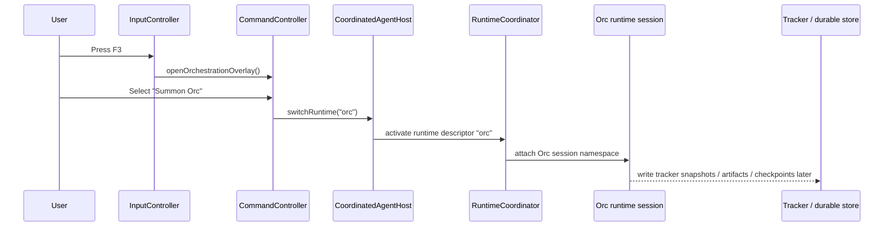

# Orc orchestration Phase 1 scaffold

This document is the stable orientation guide for engineers who need to understand how the Phase 1 Orc orchestration skeleton is organized today, where the entry points live, and which parts are intentionally placeholders.

## What Phase 1 includes

Phase 1 establishes a durable file layout, a dedicated Orc runtime/session namespace in the TUI, and stable TypeScript contracts for control-plane state, tracker snapshots, checkpoint manifests, and orchestration artifacts.

Phase 1 does **not** yet provide a real LangGraph-backed execution engine. The current implementation is a scaffold that makes the future runtime boundaries explicit without locking the team into unstable third-party SDK types.

## Entry points: Orc menu and launch path

The fastest way to trace Orc from the UI down into the runtime shell is this path:

1. `src/input-controller.ts` routes the `F3` key to `CommandController.openOrchestrationOverlay()`. The Orc menu is therefore anchored at the dedicated F3 top-level menu entry.
2. `CommandController.openOrchestrationOverlay()` in `src/command-controller.ts` builds the Phase 1 Orc menu, including **Summon Orc**, **Dashboard**, **Resume Thread**, **Inspect Checkpoints**, **Rewind Checkpoint**, and document browser actions.
3. The **Summon Orc** menu item calls `CommandController.summonOrc()`.
4. `summonOrc()` switches the active runtime to `"orc"` via `this.host.switchRuntime("orc")`.
5. The Orc runtime itself is registered in `VibeAgentApp` inside `src/app.ts` as a `CompatAgentRuntime` with descriptor id `"orc"`, kind `"orchestration"`, and capability flags such as `"planning"`, `"checkpoint-visibility"`, and `"orchestration-status"`.
6. The Orc runtime uses a `DirectAgentHost` whose `SessionManager` points to `getRuntimeSessionDir("orc", process.cwd(), this.durableRootPath)`, so Orc chat state is isolated from the standard coding runtime session namespace.

### Compact flow

```text
F3
  -> CommandController.openOrchestrationOverlay()
  -> "Summon Orc"
  -> CommandController.summonOrc()
  -> CoordinatedAgentHost.switchRuntime("orc")
  -> RuntimeCoordinator activates descriptor id "orc"
  -> Orc-specific session namespace under ~/Vibe_Agent/sessions/
  -> future tracker/checkpoint/artifact persistence under ~/Vibe_Agent
```

### Sequence diagram



## Runtime and module layout under `src/orchestration/`

Phase 1 keeps orchestration types and storage boundaries under `src/orchestration/` so later execution engines can plug into stable interfaces.

### `src/orchestration/orc-runtime.ts`

This file defines the runtime boundary rather than a finished executor.

- `OrcRuntimeAdapters` is the future integration seam for LangGraph and DeepAgents bootstrap code.
- `OrcSessionFactory` is the placeholder creation boundary where merged security policy should be attached before any worker tooling launches.
- `OrcRuntime` is the stable interface for launch, resume, tracker-state load, and artifact enumeration.
- `OrcRuntimeSkeleton` is the current placeholder implementation. It merges security policy, creates an `OrcSession`, and intentionally throws for `launch()` and `resumeThread()` because the real graph execution layer is not implemented yet.

### `src/orchestration/orc-session.ts`

This file defines the in-memory session contract.

- `OrcSession` is the minimal interface for a single orchestration thread.
- `OrcSessionHandle` is the Phase 1 implementation carrying `threadId`, optional `checkpointId`, optional `securityPolicy`, and an optional in-memory `OrcControlPlaneState` snapshot.

### `src/orchestration/orc-state.ts`

This file is the core control-plane schema.

- `OrcLifecyclePhase` names the expected lifecycle states, from `"idle"` through `"checkpointed"` to terminal states like `"completed"` and `"failed"`.
- `OrcProjectContext` captures the stable project bootstrap payload.
- `OrcOrchestratorMessage` normalizes message metadata without coupling callers to LangGraph-native envelopes.
- `OrcActiveExecutionWave` and `OrcParallelWorkerResult` reserve shape for future parallel subagent work.
- `OrcVerificationError` reserves the structure for build/test/lint/review verification results.
- `OrcControlPlaneState` is the main snapshot object persisted through the tracker/checkpoint layer.

### `src/orchestration/orc-security.ts`

This file defines Phase 1 orchestration guardrail contracts.

- `OrcSecurityPolicy` and `OrcSecurityPolicyOverrides` describe the policy snapshot to carry into sessions and future worker execution.
- `createDefaultOrcSecurityPolicy()` derives default policy from `AppConfig`.
- `mergeOrcSecurityPolicy()` merges request-level overrides onto the baseline policy.
- `ORC_SECURITY_STATUS_TEXT` and `OrcSecurityEvent` provide UI-stable event payloads for future approval-required and blocked-command states.

### `src/orchestration/orc-io.ts`

This file defines the external I/O payloads and durable artifact identities.

- `LaunchOrcRequest` / `LaunchOrcResponse` define the launch API contract.
- `LoadOrcTrackerStateRequest` / `LoadOrcTrackerStateResponse` define tracker restoration.
- `ResumeOrcThreadRequest` / `ResumeOrcThreadResponse` define future resume semantics.
- `OrcDocumentCoordinates`, `OrcArtifactDocument`, and `OrcArtifactManifest` establish stable coordinates shared across markdown documents and machine-readable JSON companions.
- `buildOrcFileStem()` is the naming helper that converts coordinates into a deterministic file stem.

### `src/orchestration/orc-storage.ts`

This file owns file-placement and artifact-location rules.

- `getOrcArtifactLocations()` maps orchestration document kinds onto durable directories such as plans, roadmaps, research, sessions, tracker, and artifact manifests.
- `resolveOrcArtifactLocation()` returns the specific markdown/json path pair and manifest path for one logical document.
- `listOrcArtifactLocations()` enumerates files by logical document kind.
- `createOrcArtifactDocument()` and `validateOrcArtifactDocument()` normalize and sanity-check durable artifact metadata.

### `src/orchestration/orc-tracker.ts`

This file owns summarized control-plane persistence and UI-friendly tracker presentation.

- `OrcTracker` is the persistence boundary.
- `FileSystemOrcTracker` persists one `OrcControlPlaneState` snapshot per `threadId` + `checkpointId` pair in the tracker directory.
- `createOrcTrackerDashboardViewModel()` converts raw control-plane state into the transcript-free dashboard model used by the Orc status overlay.
- `OrcTrackerDashboardViewModel` is intentionally optimized for a human operator view rather than raw machine execution history.

### `src/orchestration/orc-checkpoints.ts`

This file owns checkpoint metadata and manifests.

- `OrcCheckpointMetadata` is the durable record for one checkpoint.
- `OrcCheckpointManifest` is the thread-scoped manifest that tracks history, latest checkpoint, rewind targets, and artifact bundle ids.
- `OrcCheckpointStore` is the storage abstraction.
- `LocalFileOrcCheckpointStore` writes manifests to `checkpoints/<thread>/thread-manifest.json` and individual checkpoints to `checkpoints/<thread>/checkpoints/<checkpoint>.json`.

## Durable root: `~/Vibe_Agent`

Phase 1 formalizes `~/Vibe_Agent` as the Vibe-owned durable root. The path helpers live in `src/durable/durable-paths.ts`, with `VIBE_DURABLE_ROOT` and `ensureVibeDurableStorage()` defining the canonical tree bootstrap behavior.

### Durable subdirectories

The current tree is:

```text
~/Vibe_Agent/
├── artifacts/
├── auth/
├── checkpoints/
├── config/
├── logs/
├── memory/
├── plans/
├── research/
├── roadmaps/
├── sessions/
└── tracker/
```

### What each directory is for

- `artifacts/`: machine-readable artifact manifests and durable artifact-sidecar records.
- `auth/`: reserved for future Vibe-owned auth material; legacy pi-mono auth still lives elsewhere until migration is defined.
- `checkpoints/`: per-thread checkpoint manifests plus checkpoint metadata files.
- `config/`: Vibe-owned config, including `vibe-agent-config.json`.
- `logs/`: durable log catalog records.
- `memory/`: future durable memory store manifests.
- `plans/`, `research/`, `roadmaps/`: markdown-first Orc planning artifacts plus paired JSON manifests.
- `sessions/`: Orc-specific session namespaces. `getRuntimeSessionDir()` further partitions this by runtime id and encoded workspace path.
- `tracker/`: tracker snapshots, tracker catalog data, and the reserved `LANGEXTtracker.md` export path.

### Important migration boundary

Phase 1 intentionally keeps inherited pi-mono data separate:

- Orc-owned session state is moved under `~/Vibe_Agent/sessions/...`.
- Coding-runtime session files and pi-mono auth state still remain in the inherited pi-mono storage path until an explicit migration is designed.

## How tracker documents, markdown artifacts, and machine-readable manifests relate

Phase 1 distinguishes between three related but different persistence layers.

### 1. Tracker state snapshots

Tracker snapshots are control-plane state captures.

- `FileSystemOrcTracker.save()` writes `OrcControlPlaneState` JSON into the tracker directory.
- The file naming convention is `<threadId>--<checkpointId>.json` through `getVibeTrackerPath()`.
- These files are optimized for restoring or inspecting orchestrator state, not for polished human-readable planning output.

### 2. Markdown artifacts

Markdown artifacts are the narrative outputs humans are expected to read.

- The logical kinds are defined by `OrcDocumentKind` in `src/orchestration/orc-io.ts`: `plan`, `roadmap`, `research`, `session`, `tracker`, and `artifact-manifest`.
- `resolveOrcArtifactLocation()` maps those kinds to directories like `plans/`, `roadmaps/`, `research/`, `sessions/`, and `tracker/`.
- `buildOrcFileStem()` gives each logical document a deterministic stem using project/phase/task/thread/wave/timestamp coordinates.

### 3. Machine-readable manifests

Each human-readable document can have a paired JSON companion and an inventory manifest.

- `OrcArtifactManifest` is the stable JSON schema for a document pair.
- `resolveOrcArtifactLocation()` returns both the main file path and the paired markdown/json path.
- `WorkbenchInventoryService` synthesizes orchestration-document views, plus lightweight generated manifests and summaries, into `tracker/catalog.json` for the Artifact Viewer.

### Practical relationship between the three layers

A useful way to think about the scaffold is:

- **Tracker snapshot** = current orchestration control-plane state for one checkpoint.
- **Markdown artifact** = human-friendly output for plans, research, roadmaps, sessions, or tracker summaries.
- **Machine-readable manifest** = deterministic metadata proving what files belong together and how external tooling can discover them.

Tracker state is therefore the operational truth of the orchestrator, while markdown and manifest files are the durable publication layer around that operational truth.

## Checkpoint and thread data: how it is expected to evolve later

Phase 1 checkpointing is intentionally conservative.

### What exists now

- `OrcThreadIdentity` already reserves `projectId`, `runtimeId`, and `sessionId` alongside `threadId`.
- `OrcCheckpointMetadata` already stores `parentCheckpointId`, `sequenceNumber`, `resumeData`, `stateSnapshot`, `artifactBundleIds`, and `rewindTargetIds`.
- `OrcStateSnapshotRef.format` already anticipates multiple backing formats: `"control-plane-state"`, `"langgraph-checkpoint"`, and `"external-reference"`.
- `OrcPhaseResumeData` already reserves resume tokens, cursors, active wave ids, worker ids, and metadata.

### Expected later-phase evolution

Later phases are expected to expand thread and checkpoint data in the following way:

1. `threadId` stays the stable external handle shown in the UI and used for resume/review workflows.
2. `checkpointId` becomes the durable rewind and audit handle for a specific orchestration state transition.
3. `stateSnapshot` will point at either full control-plane JSON, a real LangGraph checkpoint blob, or an external reference into a future checkpoint backend.
4. `resumeData` will accumulate execution-engine-specific cursors needed to restart a paused graph, replay a wave, or rehydrate worker state.
5. `workerResults` and `activeWave` inside `OrcControlPlaneState` will become the summary layer for a richer subagent execution graph rather than the execution graph itself.
6. tracker snapshots will likely remain slim, while richer machine-native checkpoint payloads move behind `stateSnapshot.storageKey` and `format`.

The important design choice is that Phase 1 already separates **operator-facing thread/checkpoint metadata** from the future **engine-native checkpoint payload**.

## Named entry points engineers should inspect first

For a new engineer, these are the quickest places to open first:

- UI menu launch: `CommandController.openOrchestrationOverlay()` and `CommandController.summonOrc()` in `src/command-controller.ts`.
- F3 keyboard routing: `InputController.openOrcSubmenu()` in `src/input-controller.ts`.
- Runtime registration: Orc `CompatAgentRuntime` descriptor inside `VibeAgentApp` in `src/app.ts`.
- Orc session namespace: `getRuntimeSessionDir()` in `src/runtime/runtime-session-namespace.ts`.
- Runtime contract: `OrcRuntime`, `OrcRuntimeSkeleton`, and `OrcSessionFactory` in `src/orchestration/orc-runtime.ts`.
- Control-plane schema: `OrcControlPlaneState` in `src/orchestration/orc-state.ts`.
- Tracker persistence: `FileSystemOrcTracker` in `src/orchestration/orc-tracker.ts`.
- Checkpoint persistence: `LocalFileOrcCheckpointStore` in `src/orchestration/orc-checkpoints.ts`.
- Artifact path resolution: `resolveOrcArtifactLocation()` and `getOrcArtifactLocations()` in `src/orchestration/orc-storage.ts`.
- Durable root bootstrap: `ensureVibeDurableStorage()` and `VIBE_DURABLE_ROOT` in `src/durable/durable-paths.ts`.
- Inventory/document browser glue: `WorkbenchInventoryService` in `src/durable/workbench-inventory-service.ts`.

## Future phases and intentional placeholders

Several pieces are explicitly placeholders in Phase 1 and should be treated that way when planning follow-up work.

### Subagents are not active yet

The schema already talks about waves, worker ids, parallel results, and sandbox policy, but Phase 1 does not actually launch subagents. Those fields exist so downstream UI and durable storage can stabilize before worker orchestration ships.

### LangGraph execution is not wired yet

`OrcRuntimeAdapters.createLangGraph` and `initializeDeepAgents` are future seams only. `OrcRuntimeSkeleton.launch()` and `resumeThread()` intentionally throw because real graph execution is deferred to a later phase.

### Resume, checkpoint inspection, and rewind are UI placeholders

The Orc menu exposes those actions now so the user journey and menu layout can settle early, but the command handlers currently show placeholder status messages instead of restoring a live orchestration thread.

### Dashboard telemetry is summarized by design

`createOrcTrackerDashboardViewModel()` intentionally hides raw transcript details. The dashboard should remain a human-readable telemetry summary even after real orchestration execution exists.

## Recommended mental model for outside engineers

If you are new to the codebase, the safest mental model is:

- The **UI path** for Orc is real today.
- The **durable storage contracts** are real today.
- The **TypeScript schemas** for state, checkpoints, artifacts, and security policy are real today.
- The **execution engine** behind those schemas is still a placeholder.

That split is intentional. Phase 1 is about establishing stable names, locations, and file contracts so later orchestration work can ship without repeatedly reshaping the operator-facing surface area.
