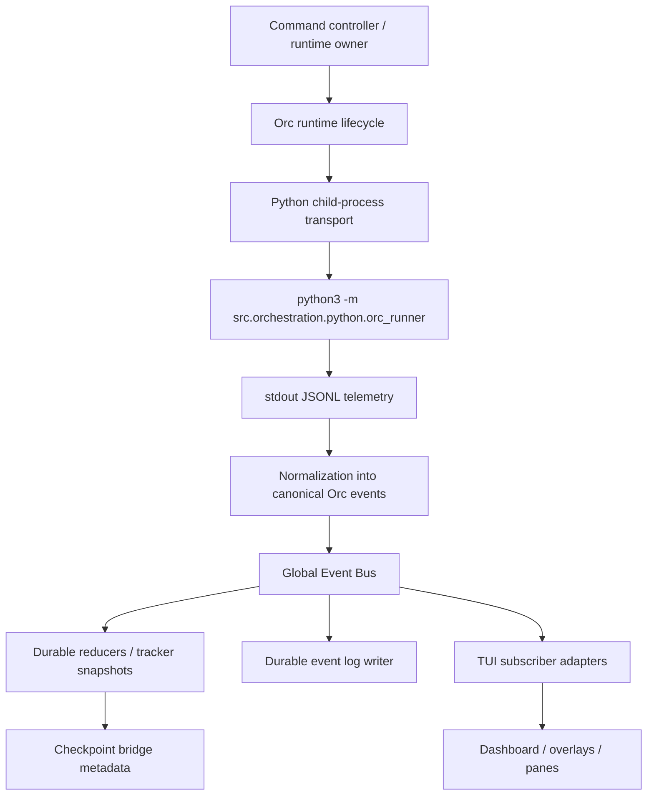

# Orc orchestration Phase 2 orientation guide

This document is now the stable Phase 2 reference for outside engineers. Phase 2 implementation has landed, so this guide no longer acts primarily as a backlog. Instead, it explains how the Orc worker-execution plane is assembled, what is durable vs transient, how to troubleshoot it, and which boundaries intentionally remain deferred to later phases.

Phase 2 assumes the Phase 1 scaffold documented in `docs/orchestration/phase-1-scaffold.md` and should be read alongside `LANGEXTtracker.md`, which remains the append-only process ledger and sign-off artifact for this feature line.

## What Phase 2 delivered

Phase 2 made the Orc execution plane operational in these ways:

- supervised Python-runner launch and resume from the TypeScript runtime;
- strict stdout JSONL telemetry with stderr kept separate for diagnostics;
- canonical event normalization into a typed Global Event Bus (GEB);
- durable event logging and reduced control-plane state snapshots;
- TUI subscriber adapters for dashboards, subagent surfaces, overlays, and transport-health summaries; and
- explicit transport, cancellation, security, and fault classification boundaries suitable for outside-engineer support work.

Phase 2 is intentionally **not** the replay/recovery phase. Full in-flight resurrection, replay-aware resume, and durable super-step reconstruction remain Phase 3 work.

## End-to-end architecture

## Component orientation

### 1. Python runner

**Role**
- Acts as the Python-side execution entry point for LangGraph/DeepAgents-backed runs.
- Accepts one structured JSON launch envelope from stdin.
- Emits machine-readable JSONL to stdout and pushes diagnostics to stderr.

**Stable contract**
- Module path: `src/orchestration/python/orc_runner/`
- Invocation shape: `python3 -m src.orchestration.python.orc_runner`
- Input envelope responsibilities: thread id, project/workspace roots, merged security policy snapshot, phase intent, and resume/checkpoint context.

**Why it matters**
- It gives TypeScript one deterministic summon path regardless of later Python implementation changes.
- It isolates Python dependency churn from the TUI-facing event vocabulary.

### 2. JSONL transport

**Role**
- Owns process spawn, stdout assembly, stderr capture, cancellation/shutdown requests, and timeout/fault classification.
- Converts broken lines, malformed payloads, and lifecycle disruptions into canonical events instead of runtime crashes.

**Key expectations**
- Stdout is newline-delimited JSON only.
- Stderr remains available for human diagnostics.
- Child-process details stay hidden behind runtime hooks; UI code should not work directly with `spawn()` handles.

### 3. Event normalization

**Role**
- Converts runner/transport payloads into a stable Orc event vocabulary.
- Preserves raw upstream detail in namespaced passthrough fields for forensics.
- Standardizes `who did what how at when` semantics so reducers and presentation helpers are decoupled from upstream callback quirks.

**Canonical categories covered in Phase 2**
- process lifecycle;
- graph lifecycle;
- worker/subagent activity;
- user-facing messages;
- tool calls/results;
- checkpoint metadata;
- security approval/blocking notices;
- stream warnings; and
- transport/runtime faults.

### 4. Global Event Bus (GEB)

**Role**
- The GEB is the only supported fan-out path for orchestration telemetry.
- Preserves per-run ordering and provides decoupled publication for reducers, log writers, and TUI subscribers.
- Applies queue/backpressure safeguards so bursty worker telemetry does not directly destabilize consumers.

**Why outside engineers should care**
- If a new view, debug tool, or postmortem utility needs Orc telemetry, it should subscribe here rather than adding transport-level listeners.

### 5. Durable event logging

**Role**
- Persists normalized events under `~/Vibe_Agent/logs/orchestration/event-log/threads/<thread>/runs/<run>/`.
- Uses append-only JSONL segment files and a run manifest.
- Separates forensics/replay data from TUI rendering and reduced tracker state.

**Operational rule**
- Event-log persistence failures are visible but non-fatal; they should not independently terminate a live run.

### 6. Reduced control-plane state and tracker snapshots

**Role**
- Folds the canonical event stream into durable run summaries for lifecycle, active wave, worker results, checkpoint metadata, transport health, security blockers, and terminal state.
- Produces slim, handoff-safe state snapshots for operators and future resume flows.

**Boundary**
- Tracker snapshots are not raw debug mirrors. They intentionally retain summary truth rather than every transport detail.

### 7. TUI subscriber pattern

**Role**
- `src/orchestration/orc-tui-subscriber.ts` is the adapter boundary between the GEB and TUI surfaces.
- Batches event bursts, owns subagent surface identity/lifecycle rules, and exposes stable slices for dashboards, overlays, and panes.

**Rule for future engineers**
- Add new Orc views by extending subscriber-owned slices first. Do not bind TUI components directly to transport streams, raw parser output, or Python lifecycle events.

## Durable vs transient reference

| Layer | Durable | Purpose | Notes |
| --- | --- | --- | --- |
| Event-log segments + manifest | Yes | Replay, postmortem, Phase 3 recovery input | Canonical normalized stream. |
| Reduced tracker snapshot / checkpoint metadata | Yes | Resume, operator handoff, dashboards | Summary truth, not raw event detail. |
| Debug artifacts | Yes, opt-in | Outside-engineer diagnostics | Separate from default operator surfaces. |
| TUI subscriber slices | No | Live rendering | Rebuilt from live events, not persisted wholesale. |
| Process handles / stdout buffers | No | Runtime internals | Must not leak to UI integrations. |

## Execution flow reference

1. Orc runtime prepares launch or resume state and constructs the run-owned dependencies.
2. The Python transport spawns `python3 -m src.orchestration.python.orc_runner`.
3. TypeScript writes one JSON launch envelope to stdin.
4. Python emits strict single-line JSON telemetry over stdout.
5. The transport incrementally reassembles lines, classifies lifecycle/parse/fault conditions, and forwards valid envelopes for normalization.
6. Normalization converts raw payloads into canonical Orc events.
7. The GEB publishes those canonical events to reducers, event-log persistence, and TUI subscriber adapters.
8. Reducers update durable control-plane state; event logs append normalized records; subscribers batch live UI updates.
9. Terminal, cancellation, or transport-failure events trigger deterministic cleanup and final tracker/checkpoint persistence.

## Fault handling and operational posture

### Supported Phase 2 fault classes

| failure class | canonical code | terminal state | engineer posture |
| --- | --- | --- | --- |
| Startup failure | `transport_startup_failure` | `failed` | Fix the summon contract or environment, then relaunch with a fresh process. |
| Transport disconnect | `transport_disconnect` | `failed` | Treat as a failed run and inspect logs; replay-aware recovery is deferred to Phase 3. |
| Broken pipe | `transport_broken_pipe` | `failed` | Inspect stderr and runner health, then restart as a fresh run. |
| Non-zero exit | `transport_non_zero_exit` | `failed` | Inspect tracker + event log + stderr before retrying. |
| Signal shutdown | `transport_signal_shutdown` | `failed` | Determine whether an external signal interrupted the run. |
| User cancellation | `transport_user_cancellation` | `cancelled` | Expected stop; a fresh run is allowed, automatic replay is not. |
| Ambiguous terminal state | `transport_ambiguous_terminal_state` | `ambiguous` | Correlate tracker snapshots and event logs before changing code. |

### Fault-handling rules

- Convert malformed output into canonical warning/fault events whenever possible.
- Avoid duplicate terminal publication; the runtime, tracker, and TUI should converge on one terminal summary.
- Keep persistence best-effort and non-fatal.
- Record unresolved replay/recovery limitations explicitly rather than pretending Phase 2 can restore in-flight work.

## Troubleshooting and diagnostics for outside engineers

### Recommended inspection order

1. **Tracker snapshot / `LANGEXTtracker.md`**: confirm the reduced state, blocker notes, validation history, and current deferred-work posture.
2. **Durable event log**: confirm the exact canonical event stream seen by reducers and subscribers.
3. **Debug artifacts**: only if needed, inspect stderr, raw mirrors, parser warnings, and transport diagnostics.
4. **Code-level contracts**: inspect normalization, subscriber, and reducer boundaries only after artifacts disagree.

### Artifact map

| Artifact | Location | Use it for |
| --- | --- | --- |
| Durable event log | `~/Vibe_Agent/logs/orchestration/event-log/threads/<thread>/runs/<run>/` | Canonical event sequence and postmortems. |
| Debug stderr capture | `~/Vibe_Agent/logs/orchestration/debug/threads/<thread>/runs/<run>/python-stderr.jsonl` | Python import/setup/runtime errors. |
| Raw event mirror | `~/Vibe_Agent/logs/orchestration/debug/threads/<thread>/runs/<run>/raw-event-mirror.jsonl` | Compare pre-reducer output with normalized event logs. |
| Parser warnings | `~/Vibe_Agent/logs/orchestration/debug/threads/<thread>/runs/<run>/parser-warnings.jsonl` | Malformed JSONL, sequence anomalies, partial-line truncation. |
| Transport diagnostics | `~/Vibe_Agent/logs/orchestration/debug/threads/<thread>/runs/<run>/transport-diagnostics.jsonl` | Ready/idle/stall/fault timing and child-process lifecycle. |
| Runtime metadata | `~/Vibe_Agent/logs/orchestration/debug/threads/<thread>/runs/<run>/runtime-metadata.json` | Spawn command, cwd, artifact paths, ids, and debug caveats. |
| Tracker snapshots | `~/Vibe_Agent/tracker/<thread>--<checkpoint>.json` | Reduced durable state and handoff-safe summaries. |

### Common symptom matrix

| Symptom | First artifact | What it usually means | Next action |
| --- | --- | --- | --- |
| Runner never starts | `runtime-metadata.json`, `transport-diagnostics.jsonl` | Spawn contract, cwd, or module-path issue | Fix environment/entry point first. |
| JSONL parse noise | `parser-warnings.jsonl` | Emitter formatting or stdout contamination | Restore strict single-line JSON on stdout. |
| Dashboard looks wrong but logs look right | Durable event log + tracker snapshot | Presentation/subscriber issue | Inspect summary helpers and subscriber slices. |
| Run appears hung | `transport_idle_timeout` or `transport_stall_timeout` diagnostics | Runner emitted no readable progress | Compare stderr and last durable event-log offset. |
| Resume lacks in-flight worker state | Tracker/checkpoint metadata | Expected Phase 2 limitation | Carry into Phase 3 replay/recovery work. |

## Deferred work that later phases inherit

These items are intentionally deferred and should not rely on conversational memory alone:

- replace bootstrap/demo Python telemetry with live LangGraph and DeepAgents callback bindings;
- implement replay-aware event-log discovery, segment enumeration, and republishing during resume/recovery;
- restore in-flight worker execution from durable checkpoints rather than only reduced metadata;
- wire live command/tool interception so canonical security telemetry is emitted by real worker runtime hooks; and
- connect the subscriber-owned `subagentSurfaces` state to the main application overlay/pane controllers everywhere Orc is presented live.

## Scribe publication gate for completion

Phase 2 now treats documentation publication as a completion prerequisite instead of best-effort follow-up work.

- Orc hands finalized implementation context (including AST/context references and feature scope) to the Scribe subgraph.
- Scribe must update public-interface documentation (docstrings/API docs) plus the README and architecture notes for the feature.
- Scribe must emit a diff-summary artifact that enumerates documentation paths changed for the run.
- Orc is not allowed to emit final `done` unless Scribe returns an explicit success signal.

## Completion checklist mapped to Phase 2 criteria and design mandates

| Exit criterion / mandate | Phase 2 status | Evidence / reference |
| --- | --- | --- |
| Worker lifecycle is operational | Implemented | Runtime-owned launch/resume supervision, transport lifecycle events, and deterministic cleanup are now part of the live Phase 2 stack. |
| Dependency-aware, isolated execution plane exists | Implemented in Phase 2 scope | Python runner + child-process transport + canonical event ownership establish the worker-execution plane boundary; replay-aware resurrection is deferred. |
| Python emits strict JSONL telemetry | Implemented | Stdout is reserved for single-line JSON, stderr for diagnostics, with malformed-stream recovery documented above. |
| Typed Global Event Bus exists | Implemented | Canonical normalized events flow through the async GEB to reducers, logs, and TUI subscribers. |
| Durable event logging exists | Implemented | Append-only event-log segments + manifest persist normalized events independent of rendering. |
| Friendly operator telemetry exists | Implemented | Presentation helpers and subscriber slices summarize agent/user, tool, security, and transport activity. |
| TUI consumes subscriber adapters, not transport internals | Implemented boundary | `orc-tui-subscriber` is the supported adapter boundary for dashboards/overlays/panes. |
| Faults, malformed streams, and cancellations are handled | Implemented in Phase 2 scope | Canonical warning/fault taxonomy plus terminal-state convergence are in place. |
| DM-01 thin orchestrator boundary | Satisfied in Phase 2 scope | TypeScript runtime coordinates; Python workers emit telemetry without exposing raw worker mechanics to the TUI. |
| DM-04 wave-based isolated execution workers | Partially satisfied / Phase 2 foundation complete | Wave-aware worker state and subagent surfaces exist; richer replay/recovery remains later-phase work. |
| DM-05 durable persistence and resumability bridge | Bridge complete | Tracker/checkpoint metadata and event-log offsets now define the Phase 3 handoff contract. |
| DM-06 secure tool interception and confinement telemetry | Telemetry complete, live enforcement still expanding | Canonical security approval/block events exist; full upstream hook wiring is deferred. |
| DM-08 durable artifacts for continuity | Satisfied | Tracker, event logs, debug artifacts, and handoff notes form the durable engineer/operator trail. |

## Relationship to `LANGEXTtracker.md`

`LANGEXTtracker.md` remains the governing process artifact for:

- ledger-row completion state;
- validation evidence;
- risks/blockers refreshes;
- next-session handoff items;
- sign-off notes; and
- explicit deferred-work capture.

Use this orientation guide to understand the implemented system. Use the tracker to understand what was validated, what remains deferred, and what the next engineer should pick up.
